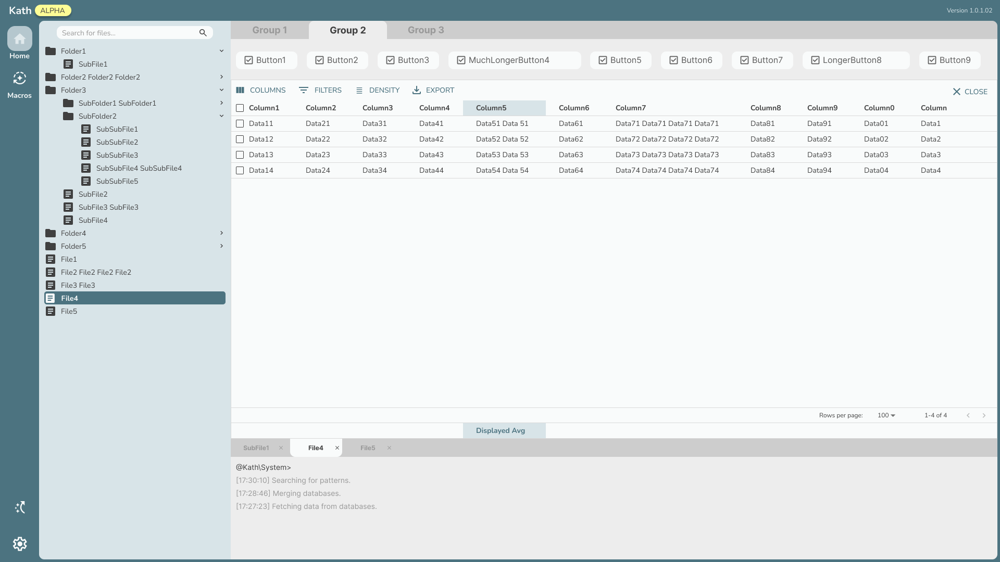
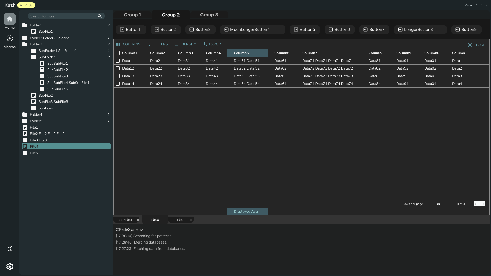

<div align="center">
    
    <h3>kath</h3>
    <p>No Code Gene Analysis Tool</p>
</div>

###  Project Overview

**kath** is a user-friendly GUI tool designed for the in-depth analysis of gene variation data sourced from LOVD, GNOMAD, and CLINVAR databases. It brings together a robust suite of functionalities that facilitate genetic research and analysis.

<div align="center">
	
  
</div>

---

### 👥 Teams Structure

#### 📣 Communications Team:

| **Team Member** | **Institution** | **Role** | **GitHub** | **LinkedIn** | **Active** |
|:-:|:-:|:-:|:-:|:-:|:-:|
| Kazimieras Bagdonas | Kaunas University of Technology | Project Mentor |  | [kazbag](https://www.linkedin.com/in/kazbag/) | ✅ |
| Ignas Sabaliauskas | Kaunas University of Technology | Communications Lead |  | [ignas-sabaliauskas](https://www.linkedin.com/in/ignas-sabaliauskas/) | ✅ |

#### 🧩 Front End Team:

| **Team Member** | **Institution** | **Role** | **GitHub** | **LinkedIn** | **Active** |
|:-:|:-:|:-:|:-:|:-:|:-:|
| Mantvydas Deltuva | Kaunas University of Technology | Lead Frontend Developer | [mantvydasdeltuva](https://github.com/mantvydasdeltuva/) | [mantvydasdeltuva](https://www.linkedin.com/in/mantvydasdeltuva/) | ✅ |
| Justinas Teselis | Kaunas University of Technology | Frontend Developer | [justinnas](https://github.com/justinnas/) | [justinasteselis](https://www.linkedin.com/in/justinasteselis/) | ✅ |
| Paulius Preikša | Kaunas University of Technology | Frontend Developer | [PauliusPreiksaCode](https://github.com/PauliusPreiksaCode) | [paulius-preiksa](https://www.linkedin.com/in/paulius-preiksa/) | ❌ |

#### 🗄️ Back End Team:

| **Team Member** | **Institution** | **Role** | **GitHub** | **LinkedIn** | **Active** |
|:-:|:-:|:-:|:-:|:-:|:-:|
| Dainius Kirsnauskas | Kaunas University of Technology | Lead Backend Developer | [Strexas](https://github.com/Strexas) | [here](https://www.linkedin.com/in/dainius-kirsnauskas-2b8915276/) | ✅ |
| Vladyslav Levchenko | Kaunas University of Technology | Backend Developer | [Akaud](https://github.com/Akaud) | [here](https://www.linkedin.com/in/vladyslav-levchenko-409656324/) | ✅ |
| Kajus Černiauskas | Kaunas University of Technology | Backend Developer | [KajusC](https://github.com/KajusC) | [here](https://www.linkedin.com/in/kajus-%C4%8Derniauskas-a68506205/) | ✅ |
| Nojus Sajauskas | Kaunas University of Technology | Backend Developer | [nojux-official](https://github.com/nojux-official) | [here](https://www.linkedin.com/in/nojus-sajauskas-7aa74b259/) | ❌ |

---

### 🤝 Partners

We proudly acknowledge our partners who contribute their expertise and resources to support kath’s development:

<div align="center">
  <div>
    
    <h3><a href="https://www.harvard.edu">Harvard University</a></h3>
    <p>Leading institution in education and research.</p>
  </div>
  <div>
    
    <h3><a href="https://genomika.lt">Genomika Lietuva</a></h3>
    <p>Innovative solutions in genomics and biotechnology.</p>
  </div>
</div>

---

### ⚙️ Setup Instructions

For a complete setup, follow these steps and refer to the `README.md` files in `app/front_end` and `app/back_end` for detailed configurations.

1. **Clone the Repository**

    ```bash
    git clone https://github.com/your-repo/kath.git
    ```

2. **Complete Front-end and Back-end Setup**

    - Go to the `app/front_end` and `app/back_end` directories.
    - Open the `README.md` file in each directory and follow the specific installation and configuration steps provided.

After completing these steps, your environment should be set up and ready to run.